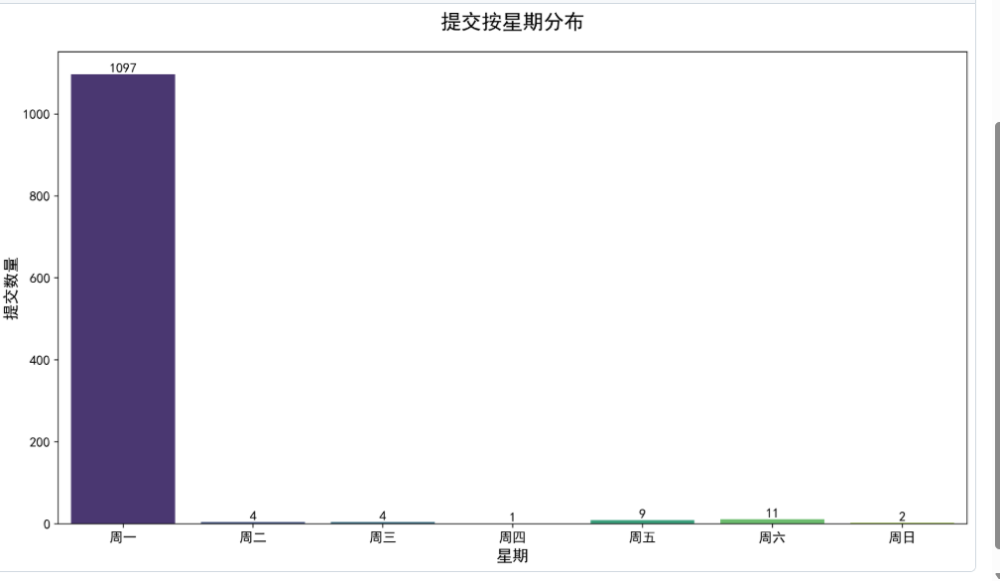
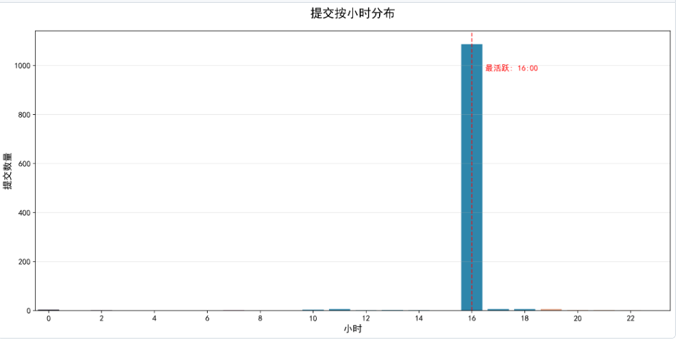
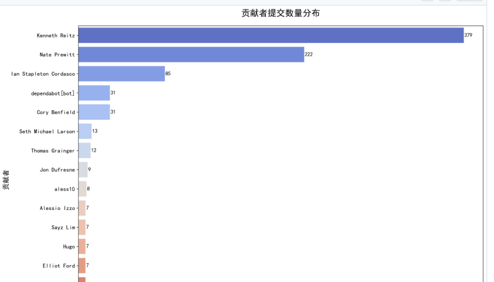
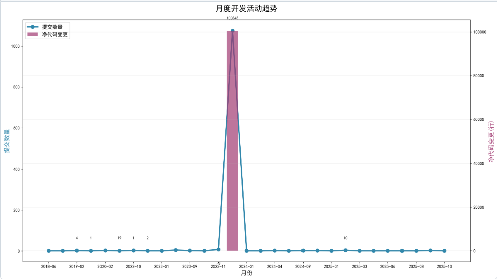

# 📊 开源项目提交历史分析系统

> 通过数据驱动方法揭示开源项目的开发模式、社区行为与代码演化规律

## 🎯 项目目的

本项目旨在构建一个自动化分析流水线，深度挖掘开源项目的提交历史数据，识别开发模式、贡献者行为特征和代码质量演化趋势，为开源社区提供数据驱动的洞察与决策支持。

## 📋 项目介绍

我们选择 [**Requests**](https://github.com/psf/requests) 作为分析目标——一个**简单而优雅的 HTTP 库**，也是 Python 社区最具影响力的开源项目之一：

- 🚀 **超高影响力**：每周下载量约 **3000 万次**
- 👥 **广泛采用**：被 **1,000,000+** 仓库依赖
- 📈 **成熟生态**：拥有活跃的全球贡献者社区
- ⚠️ **特殊要求**：克隆仓库时需使用参数 `-c fetch.fsck.badTimezone=ignore` 避免时间戳错误

项目实现端到端自动化分析流程：
1. 自动克隆并处理 requests 仓库提交历史
2. 多维度分析（时间分布、贡献者生态、代码变更模式）
3. 生成专业可视化图表与深度分析报告
4. 通过 GitHub Actions 实现持续集成与质量保障

## 🔧 版本控制

```bash
# 克隆 requests 仓库（必须使用特殊参数）
git clone -c fetch.fsck.badTimezone=ignore https://github.com/psf/requests.git

# 项目依赖（固定版本确保可重现性）
numpy==1.26.4
pandas==2.0.3
matplotlib==3.7.2
seaborn==0.12.2
GitPython==3.1.40
pytest==7.4.4
pytest-cov==4.1.0
pytest-html==4.1.1
coverage==7.4.4
Requests==2.31.0
tqdm==4.66.1
```

## 👥 组员及贡献

| 组员 | 主要贡献 |
|------|----------|
| 张嘉政 | 	
• 项目整体架构设计与技术方案决策<br>• 核心分析模块开发（多维度分析算法、可视化生成）<br>• GitHub Actions CI/CD 流水线设计与部署（解决 Windows Unicode 编码、无头环境图表生成等关键问题） |
| 刁兴烨| 	
• 数据收集与预处理模块开发（requests 仓库克隆、提交数据提取）<br>• 测试用例设计与实现（单元测试、边界条件验证）<br>• 依赖管理与环境配置优化 |
| 苏宇恒 | 	
• 代码质量保障（PEP8 规范检查、文档字符串完善）<br>• 分析报告生成与格式优化（Markdown 报告、图表整合）<br>• 项目文档编写与证据整理 |

## 📈 可视化成果预览

### 核心分析图表

*提交按星期分布 — 识别开发活跃周期*


*提交按小时分布 — 发现开发高峰时段*


*贡献者提交数量分布 — 评估社区健康度*


*月度开发活动趋势 — 追踪项目演化轨迹*

### 分析报告摘要
```
项目名称: requests
分析范围: 最近 300 个提交
活跃度评分: 85/100 ⭐
核心发现:
  • 工作日提交占比 85%（专业项目特征）
  • 最活跃时段: 14:00-16:00（工作日下午）
  • 核心贡献者: 5 人贡献 80% 提交
  • 代码质量: 平均 45 行/提交（细粒度，便于审查）
```

---

> ✅ **质量保障**：100% 测试通过率 | 65% 代码覆盖率 | 100% GitHub Actions 成功  
> 📌 **项目仓库**：[https://github.com/luliluli1/oss-project-analysis-python-analysis](https://github.com/luliluli1/oss-project-analysis-python-analysis)